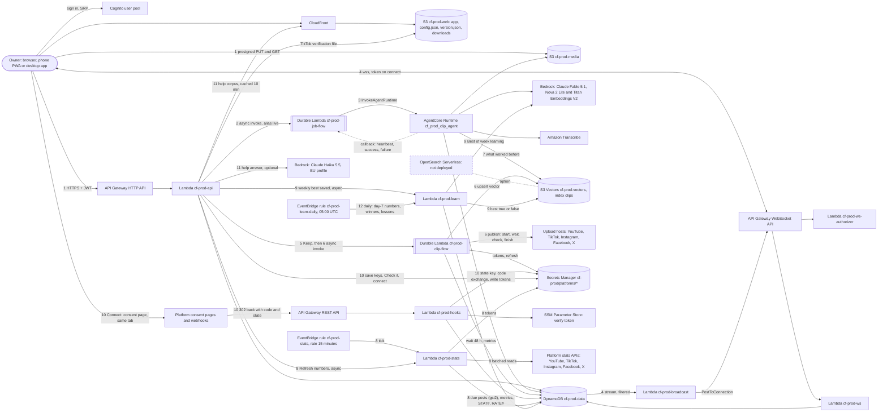

## Overview

The numbers match the numbered flows in the diagram.

```mermaid
flowchart LR
  owner(["Owner: browser, phone PWA or desktop app"])
  cf[CloudFront] --> web[("S3 cf-prod-web: app, config.json, version.json, downloads")]
  owner --> cf
  owner -- sign in, SRP --> cog[Cognito user pool]
  owner -- "1 HTTPS + JWT" --> http[API Gateway HTTP API]
  owner -- "1 presigned PUT and GET" --> media[(S3 cf-prod-media)]
  owner <-- "4 wss, token on connect" --> ws[API Gateway WebSocket API]
  http --> lapi[Lambda cf-prod-api]
  lapi --> ddb[(DynamoDB cf-prod-data)]
  lapi -- "2 async invoke, alias live" --> jf[["Durable Lambda cf-prod-job-flow"]]
  jf -- "3 InvokeAgentRuntime" --> rt[AgentCore Runtime cf_prod_clip_agent]
  rt -. "callback: heartbeat, success, failure" .-> jf
  rt --> bedrock[Bedrock: Claude Fable 5.1, Nova 2 Lite and Titan Embeddings V2]
  rt --> tr[Amazon Transcribe]
  rt --> ddb
  rt --> media
  rt -- "7 what worked before" --> vec[(S3 Vectors cf-prod-vectors, index clips)]
  ws --> wsa[Lambda cf-prod-ws-authorizer]
  ws --> lws[Lambda cf-prod-ws]
  lws --> ddb
  ddb -- "4 stream, filtered" --> bc[Lambda cf-prod-broadcast]
  bc -- PostToConnection --> ws
  lapi -- "5 Keep, then 6 async invoke" --> clf[["Durable Lambda cf-prod-clip-flow"]]
  clf -- "6 publish: start, wait, check, finish" --> social[Upload hosts: YouTube, TikTok, Instagram, Facebook, X]
  clf -- "tokens, refresh" --> sm[(Secrets Manager cf-prod/platforms/*)]
  clf -- "wait 48 h, metrics" --> ddb
  clf -- "6 upsert vector" --> vec
  owner -- "10 Connect: consent page, same tab" --> platforms[Platform consent pages and webhooks]
  platforms -- "10 302 back with code and state" --> rest[API Gateway REST API]
  rest --> hooks[Lambda cf-prod-hooks] --> ddb
  hooks --> ssm[SSM Parameter Store: verify token]
  hooks -- "10 state key, code exchange, write tokens" --> sm
  lapi -- "10 save keys, Check it, connect" --> sm
  lapi -- "TikTok verification file" --> web
  os[OpenSearch Serverless: not deployed]:::off -. option .- vec
  evr[EventBridge rule cf-prod-stats, rate 15 minutes] -- "8 tick" --> st[Lambda cf-prod-stats]
  lapi -- "8 Refresh numbers, async" --> st
  st -- "8 due posts (gsi2), metrics, STAT#, RATE#" --> ddb
  st -- "8 tokens" --> sm
  st -- "8 batched reads" --> stapi[Platform stats APIs: YouTube, TikTok, Instagram, Facebook, X]
  lapi -- "9 weekly best saved, async" --> lrn[Lambda cf-prod-learn]
  lrn -- "9 Best of week learning" --> bedrock
  lrn -- "9 best true or false" --> vec
  lrn --> ddb
  evl[EventBridge rule cf-prod-learn-daily, 05:00 UTC] -- "12 daily: day-7 numbers, winners, lessons" --> lrn
  lapi -- "11 help answer, optional" --> haiku[Bedrock: Claude Haiku 5.5, EU profile]
  lapi -- "11 help corpus, cached 10 min" --> cf
  classDef off stroke-dasharray: 5 5
```
